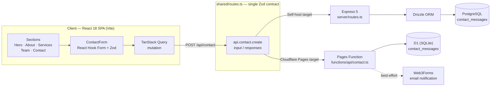
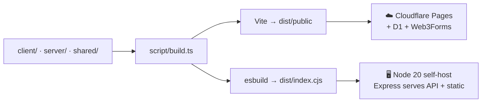

<div align="center">

# 🎬 MS2 Entertainment

### The official website of **MS2 Entertainment LLP** — a media production company crafting broadcast-ready content for Discovery, Bell Media, History TV, Hulu, and Netflix.

[](https://react.dev/)
[](https://www.typescriptlang.org/)
[](https://vite.dev/)
[](https://expressjs.com/)
[](https://orm.drizzle.team/)
[](https://tailwindcss.com/)
[](./DEPLOY.md)
[](./package.json)

**[🚀 Quickstart](#-quickstart)** &nbsp;·&nbsp; **[☁️ Deploy to Cloudflare](./DEPLOY.md)** &nbsp;·&nbsp; **[🏗️ Architecture](./replit.md)** &nbsp;·&nbsp; **[🗄️ D1 Migration](./d1-migrations/0000_create_contact_messages.sql)**

</div>

---

## ✨ What this site delivers

A dark, cinematic single-page experience (peach `#F3A28F` + mint `#8ACAC1` accents) that presents the studio, its services, its people, and captures inbound inquiries through a fully validated contact pipeline.

| Feature | What it does | Source |
|---|---|---|
| 🎥 **Video hero** | Full-screen background film with a sound toggle powered by the Web Audio API (150% volume boost when unmuted), staggered Framer Motion entrance, scroll indicator | `client/src/pages/Home.tsx` |
| 📖 **About** | The MS2 story — founders, network credits, plus Mission & Vision cards | `Home.tsx` → `#about` |
| 🛠️ **Services** | 18 capabilities across **Pre-Production** (concept, scripting, casting…), **Production** (shoots, drone & aerial, multi-camera…), **Post-Production** (edit, grade, VFX, sound, localization…) | `Home.tsx` → `#services` |
| 🤝 **Trusted by** | Partner-network logo strip with track-record stats: **10+** years of partnership, **50M+** hours processed, **99.9%** client satisfaction | `Home.tsx` |
| 👥 **Team** | 5 leadership profiles on the home page + an extended roster on the dedicated `/team` route | `Home.tsx`, `client/src/pages/Team.tsx` |
| ✉️ **Contact pipeline** | Zod-validated form → `POST /api/contact` → stored in the database → email notification → success toast. Same Zod contract enforced on client, server, and edge | `client/src/components/ContactForm.tsx`, `client/src/hooks/use-contact.ts`, `functions/api/contact.ts` |
| 🎨 **Design system** | shadcn/ui (Radix) component library, scroll-triggered reveals, Montserrat + Playfair Display typography | `client/src/components/ui/`, `client/src/index.css` |

## 🧱 Tech stack

| Layer | Technology | Version | Role |
|---|---|---|---|
| UI | React + TypeScript | 18.3 / 5.6 | Component model, type safety |
| Build | Vite | 7.3 | Dev server + client bundling |
| Routing | Wouter | 3.3 | Lightweight client-side routing |
| Styling | Tailwind CSS + shadcn/ui | 3.4 | Design system (Radix primitives) |
| Animation | Framer Motion | 11.18 | Scroll reveals, hero choreography |
| Data fetching | TanStack React Query | 5.60 | Contact-form mutation + cache |
| Forms & validation | React Hook Form + Zod | 7.55 / 3.24 | Validated inputs, shared schemas |
| Server | Express on Node.js | 5.0 / 20 | Self-host API + static serving |
| ORM | Drizzle ORM (+ drizzle-zod) | 0.39 | Type-safe DB access |
| Database | PostgreSQL **or** Cloudflare D1 | — | Depends on deploy target (below) |
| Email | Web3Forms | — | Contact-form notifications (Pages path) |
| Deploy | Cloudflare Pages (Wrangler) | 4.x | Edge hosting · project `ms2-entertainment-hub` |

## 🏗️ Architecture

One Zod contract (`shared/routes.ts`) is imported by the client, the Express server, **and** the Cloudflare Pages Function — so validation behavior is identical on every deploy target.





> **Deploy status:** the code for both targets is complete and was verified locally. Publishing to Cloudflare still needs account-side steps (Wrangler login, D1 remote migration, Web3Forms key, DNS) — see [DEPLOY.md](./DEPLOY.md).

---

## 🚀 Quickstart

**Prerequisites:** Node.js 20+, npm. For the self-host path you also need a PostgreSQL `DATABASE_URL`; the Cloudflare path needs no local database (see [DEPLOY.md](./DEPLOY.md)).

```bash
npm install

# Development — Express + Vite HMR on one port
npm run dev

# Type-check
npm run check

# Production build (client → dist/public, server → dist/index.cjs)
npm run build

# Run the production server
npm start
```

| Script | What it does |
|---|---|
| `npm run dev` | `tsx server/index.ts` — Express with Vite middleware, HMR |
| `npm run build` | `tsx script/build.ts` — Vite client + esbuild server bundle |
| `npm run start` | `node dist/index.cjs` — production server |
| `npm run check` | `tsc` — full type-check |
| `npm run db:push` | `drizzle-kit push` — push schema to PostgreSQL (self-host path) |
| `npm run cf:dev` / `cf:deploy` | Local Pages emulation / deploy via Wrangler |

Environment variables:

| Variable | Required for | Purpose |
|---|---|---|
| `DATABASE_URL` | Self-host path | PostgreSQL connection string |
| `WEB3FORMS_ACCESS_KEY` | Cloudflare Pages path | Contact-form email notifications (set as a Pages secret, never committed) |

## ☁️ Deployment

Full step-by-step for Cloudflare Pages + D1 + Web3Forms + GoDaddy DNS → **[DEPLOY.md](./DEPLOY.md)**. Deep-dive on the codebase structure → **[replit.md](./replit.md)**.

## 📁 Project structure

```
├── client/               # React 18 + Vite SPA (pages, components, hooks, shadcn/ui)
├── server/               # Express 5 API (routes, Drizzle storage, dev/prod serving)
├── shared/               # Zod schemas + route contract used by client AND server
├── functions/api/        # Cloudflare Pages Function: POST /api/contact → D1 + Web3Forms
├── d1-migrations/        # D1 (SQLite) migration for contact_messages
├── attached_assets/      # Logos, team photos, backgrounds, partner strip
├── script/build.ts       # Production build (Vite client + esbuild server)
├── wrangler.toml         # Cloudflare Pages project: ms2-entertainment-hub
├── DEPLOY.md             # Cloudflare deployment runbook
└── replit.md             # Architecture reference
```

## 📝 Repository notes & corrections

Flagged while auditing the repo for this README (no README existed before — this file is new):

- `DEPLOY.md`, `wrangler.toml`, and `functions/api/contact.ts` reference **`MIGRATION-NOTES.md`** — that file is not in the repo (stale link).
- `replit.md` mentions a `migrations/` directory — only **`d1-migrations/`** exists.
- `DEPLOY.md` step 2 asks you to replace `REPLACE_WITH_REAL_DATABASE_ID` — **`wrangler.toml` already contains a real `database_id`**, so that step is done.
- `package.json` `name` is still **`rest-express`** (Replit template leftover) — doesn't affect the build.
- `passport`, `passport-local`, `express-session`, `connect-pg-simple` are installed (and in the build allowlist) but **no auth routes or session middleware are wired** — the site has no login; don't treat auth as a feature.
- `package.json` declares **MIT**, but there is **no LICENSE file** yet.
- Contact storage is **path-dependent**: PostgreSQL for the Express self-host path, **D1 + Web3Forms** for Cloudflare Pages (`replit.md`'s "PostgreSQL" line describes only the original path).
- **No CI is configured** (single `Initial commit`) — so no CI/coverage badges are included above; `npm run build` + `npm run check` were verified locally per `DEPLOY.md`.

## 📄 License

MIT (as declared in `package.json`).

---

<div align="center">

**MS2 Entertainment LLP** · *Professional Media Services & Solutions*

</div>
